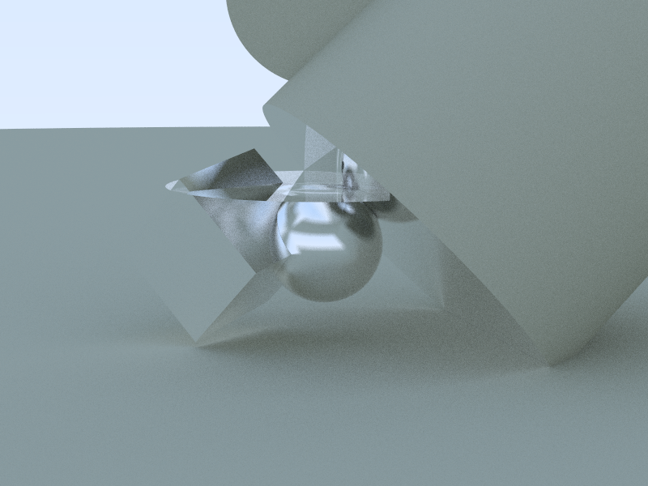
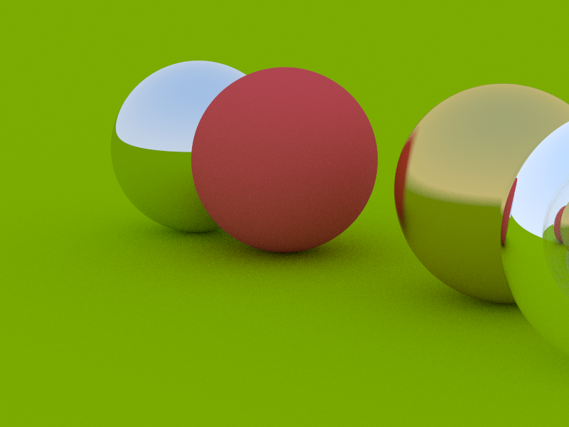

# rt



- [Context](#context)
- [Usage](#usage)
- [Features](#features)
- [Guide](#guide)
  - [Camera](#camera)
  - [World and plane](#world-and-plane)
  - [Shapes](#shapes)
    - [Sphere](#sphere)
    - [Quad](#quad)
    - [Cube](#cube)
    - [Disk](#disk)
    - [Tube](#tube)
    - [Cylinder](#cylinder)
  - [Materials](#materials)
  - [vec3](#vec3)

## Context

This is a simple ray tracer. It's one of the 01Founders Rust projects. It implments all the features from the first book in the fantastic [Ray Tracing in One Weekend](https://raytracing.github.io/) series (adapting them from C++ to Rust), and a couple from book two (quad and plane), plus a few extras, in particular a cylinder, as required by 01.

## Usage

If you don't already have Rust installed, [install it](https://www.rust-lang.org/tools/install). Clone this repository:

```sh
git clone https://github.com/pjtunstall/rt
```

Then `cd rt`, and run `cargo run --release` to build and run a program with some examples. (The `release` flag requests some optmizations that allow the program to run faster.)

See below for a more detailed [guide](#guide) on how to use the library.

## Features

- Techniques:

  - Path tracing
  - Antialiasing
  - Gamma correction
  - Defocus blur

- Parameters:

  - Position direction of camera
  - maximum recursion depth
  - samples per pixel

- Shapes:

  - Plane
  - Sphere
  - Quad
  - Cube
  - Disk
  - Tube
  - Cylinder

- Materials:

  - Lambertian (matt)
  - Metal (reflective)
  - Dielectric (reflective and refractive: transparent)



## Guide

Here is a guide to using the library. We'll draw a scene with some objects. They'll be saved in PPM (portable pixmap) format. Search for PPM viewers. There are several VS Code extension.

### Camera

First, we'll need to set up a camera.

```rust
use rt::{
    camera::{Camera, CameraParams};
}

fn main() -> {
    let camera = set_up_camera();
}

fn set_up_camera() {
    let params = CameraParameters {
        aspect_ratio: 4.0 / 3.0,
        image_width: 400,
        look_from: Point3::new(0.0, 1.0, 4.0), // x: right, y: up, z: backwards, away
        look_at: Point3::new(0.0, 0.0, -1.0),  // from the viewport.
        up: Direction::new(0.0, 1.0, 0.0),
        focal_distance: 10.0,
        defocus_angle_in_degrees: 0.0, // Zero for maximum sharpness.
        vertical_fov_in_degrees: 20.0, // Field of view: increase for wide angle.
    };

    Camera::new(params)
}
```

### World and plane

Now let's create a world with an infinite plane. Here's our world-building function.

```rust
fn create_world() -> HittableList {
    let ground_color = Color::new(0.4, 0.6, 0.); // Color components range from 0.0 to 1.0.
    let ground_material = Arc::new(Lambertian::new(ground_color)); // The thread-safe version
                                       // of `Rc`, the reference-counting smart pointer.
                                       // Reference counting allows multiple shapes to share
                                       // ownership of the same material. Thread-safety is
                                       // needed because calculations are parallelized across
                                       // all avilable CPU cores for speed.
    let plane = Plane::new(
        Point3::new(0.0, -0.5, 0.0),   // An arbitrary origin for plane coordinates.
        Direction::new(0.0, 1.0, 0.0), // A vector normal (i.e. at right angles)
        ground_material,               // to the plane. It must be nonzero.
    );
    let ground = Box::new(plane);

    let mut world = HittableList::new(); // A list of all visible objects.
    world.add(ground);

    world
}
```

And here it is in context. There's a lot of info in this next snippet, so feel free to skip some and come back to it later.

```rust
// `PathBuf` to write the file, `io` to handle errors, `Arc` to allow materials to be shared
// between objects in a thread-safe way.
use std::{io, path::PathBuf, sync::Arc};

use rt::{
  camera::{Camera, CameraParams};
  color::Color,
  hittables::{HittableList, plane::Plane}, // Hittables are visible objects, such as a plane.
  material::Lambertian, // Lambertian is an opaque, nonreflective material, defined by its color.
  ray::Ray,
}

fn main() -> io::Result<()> { // ... because writing to a file is fallible.
  let camera = set_up_camera();
  let world = create_world();
  let background = sky;

  // Maximum number of recursions before we stop calculating the contribution each collision of
  // a light ray makes to the quality of the pixel. In scenes dominated by indirect lighting,
  // it contributes to realism: deeper soft shadows, color bleeding, subtle ambient effects.
  // For scenes dominated by direct lighting, raising the depth beyond 1–2 may not show obvious
  // differences.
  let max_depth = 50;

  // To compansate for the discreteness of pixels, we take samples from the area surrounding
  // the pixel and average the resulting light (color) values together.  Higher values (more
  // samples) give a smoother, less pixelated look.
  let samples_per_pixel = 10;

  // Raising the value of either of the previous two paramers makes for a higher-quality image
  // at the cost of longer calulation time.

  // A value between 1.0 and 0.0, representing the factor by which each collision affects the
  // brightness.
  let brightness = 1.0;

  camera.render(
        &world,
        PathBuf::from("demo").join("plane"),
        max_depth,
        samples_per_pixel,
        background, // A function of the form `fn(&Ray) -> Color`.
        brightness,
    )?;

    Ok(())
}

fn set_up_camera() {
    // ...
}

// The background function could be more complex, but here we just return a constant color.
fn sky(_ray: &Ray) -> Color {
    Color::new(2.0, 3.0, 8.0)
}

fn create_world() -> HittableList {
    let ground_color = Color::new(0.4, 0.6, 0.);
    let ground_material = Arc::new(Lambertian::new(ground_color)); //
    let plane = Plane::new(
        Point3::new(0.0, -0.5, 0.0),   // An arbitrary origin for plane coordinates.
        Direction::new(0.0, 1.0, 0.0), // A vector normal to the plane.
        ground_material,
    );
    let ground = Box::new(plane);

    let mut world = HittableList::new(); // A list of all visible objects.
    world.add(ground);

  world
}
```

Alternativeley, a plane can be specified by two spanning vectors.

```rust
let plane = Plane::from_span(
    Point3::new(0.0, -0.5, 0.0),   // An arbitrary origin for plane coordinates.
    Direction::new(1.0, 0.0, 0.0), // These direction vectors define the plane
    Direction::new(0.0, 0.0, 1.0), // as their span, so they mustn't be parallel.
    ground_material,
);
```

As with the normal vector, spanning vectors mustn't be zero. In fact, for practical purposes, these and other such vectors are required to not have all their components less than `1e-8` ($1\times10^{-8}$
). This is to to prevent anomalies due to the imprecision of floating-point numbers.

### Shapes

Shapes are represented by the `Hittable` trait. (Trait is Rust's name for an interface.)

#### Sphere

Oh, the infinite plane is boring. Let's put a sphere on it.

```rust
fn create_world() -> HittableList {
    // Create plane as before.
    // ...

    let sphere_color = Color::new(0.8, 0.8, 0.8);
    let sphere_material = Arc::new(Metal::new(sphere_color, 0.0)); // That last value is the fuzziness.
                                                                   // Zero means maximum shine.
    let center = Point3::new(0.0, 0.0, -2.5);
    let radius = 0.5;
    let center = Box::new(Sphere::new(
        center,
        radius,
        sphere_material.clone(),
    ));

    let mut world = HittableList::new();
    world.add(ground);
    world.add(sphere);

    world
}
```

And that's the essence of it. To add other shapes, you just need to know the parameters that define them.

#### Quad

A quad is a parallelogram, defined by a point, a pair of direction vectors (representing the sides of the parallelogram), and a material.

```rust
let quad = Box::new(Quad::new(
    Point3::new(0.5, 0.2, -1.),     // A corner.
    Direction::new(1., 0., -1.),
    Direction::new(0., 1., 0.),
    quad_material,
));
```

#### Cube

You also two options for defining a cube. You can supply a basis to orient the cube however you like.

```rust
let cube = Box::new(Cube::new_oriented(
    Point3::new(0.0, 0., -5.),          // A corner.
    0.3,                                // Size: half edge length.
    &Basis::new_orthonormal(),          // Custom orientation.
    cube_material,                      // `Arc<dyn Material>`.
));
```

Or you can omit the basis with `Cube::new` for a cube aligned with the camera coordinate axes.

#### Disk

A disk is defined with same parameters as a quad, together with a radius. In this case, the length of the vectors is not important, only their direction, which defines the plane that contains the disk.

```rust
let disk = Box::new(Disk::new(
    Point3::new(0., 0.3, -1.),      // Center.
    0.8,                            // Radius.
    Direction::new(1., 0., 0.),
    Direction::new(0., 0., 1.),
    disk_material,
));
```

#### Tube

A hollow, finite cylinder with no cap. It's length is that of the axis vector.

```rust
let tube = Box::new(Tube::new(
    center_of_base,                 // A `Point3`.
    axis,                           // A `Direction`.
    radius,                         // `f64`.
    tube_material                   // `Arc<dyn Material>`.
);
```

#### Cylinder

Only `Cylinder` is just a bit different. It's constructor returns three shapes: a tube and two disk, representing its top and bottom. Here we destructure the return vaue into variables for each of these, so that they can be added to the world individually.

```rust
let Cylinder { tube, top, bottom } = Cylinder::new(
    Point3::new(0.2, -0.3, -1.),        // Center of base.
    Direction::new(-0.2, 3., -0.4),     // Axis, specifying length and orientation.
    0.3,                                // Radius.
    tube_material,
    top_material,
    bottom_material,
);
```

#### Materials

There are three materials, represented by the `Material` trait.

- Lambertian: `Lambertian::new` takes a color (`Color`) and returns an `Arc<dyn Material>`.
- Metal: `Metal::new` takes a color and a fuzziness (`f64`) and returns an `Arc<dyn Material>`.
- Dielectric: `Dielectric::new` takes a refractive index (`f64`) and returns an `Arc<dyn Material>`.

`Lambertian` represents materials with opaque, matt surfaces. Colors is defined by `Color::new`, which takes three `f64` values in the range [0.0, 1.0] for red, green, and blue. These can be accessed via the `r`, `g`, and `b` fields.

`Metal`s are reflective. Fuzziness is an `f64` in the range [0.0, 1.0]. Set it to 0.0 for a perfect mirror, 1.0 for dull metal.

`Dielectric` is for clear materials like glass or water. Light rays are both reflected and refracted (bent as they enter the material). The refractive index is relative. Thus set it to 1.5 for a glass object in air, and 1/1.5 for an air bubble embedded in glass. Water in air is 1.33. Other values are easily looked up.

### vec3

The `vec3` module exposes various linear algebra operations for manipulating the `Point3` and `Direction` types, including addition, scalar multiplication, dot and cross products. You might find it worth a look. There's also a `near_zero` method to check if a vector is so close to zero that it can't reliably be assumed to be nonzero due to floating-point imprecision. Components of both types can be accessed either via their `x`, `y`, and `z` fields or by indexing and iteration, as in, for example these two equivalent versions of the `Cube` method to change basis from cube coordinates to world coordinates.

The simple way:

```rust
fn direction_to_world(&self, local_direction: &Direction) -> Direction {
    Direction::new(
        local_direction[0] * self.u.x + local_direction[1] * self.v.x + local_direction[2] * self.w.x,
        local_direction[0] * self.u.y + local_direction[1] * self.v.y + local_direction[2] * self.w.y,
        local_direction[0] * self.u.z + local_direction[1] * self.v.z + local_direction[2] * self.w.z,
    )
}
```

The slick way:

```rust
fn direction_to_world(&self, local_direction: &Direction) -> Direction {
    [self.u, self.v, self.w]
        .into_iter()
        .zip(local_direction)
        .map(|(basis, s)| basis * s)
        .reduce(|a, b| a + b)
        .unwrap()
}
```
