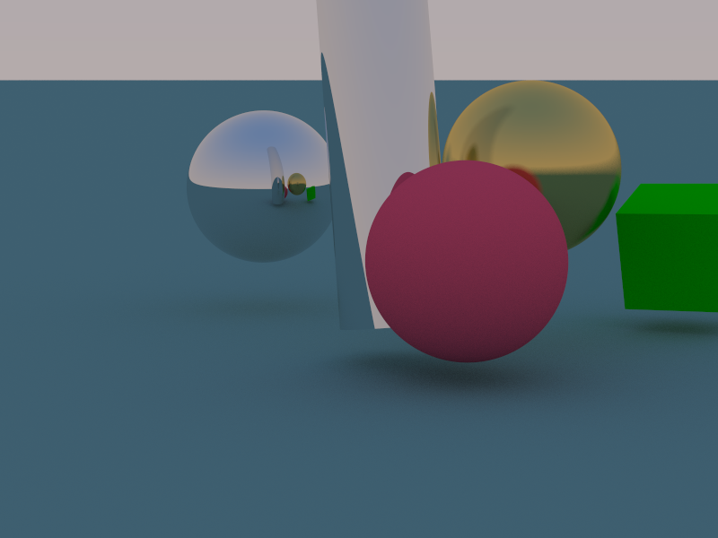
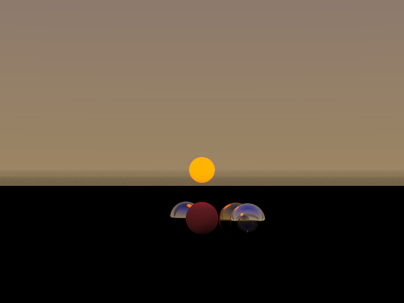

# A Ray Tracer Darkly



- [Overview](#overview)
- [Usage](#usage)
- [Features](#features)
- [Guide](#guide)
  - [Camera](#camera)
  - [World and plane](#world-and-plane)
  - [World and plane in context](#world-and-plane-in-context)
  - [Shapes](#shapes)
    - [Plane](#plane)
    - [Sphere](#sphere)
    - [Quad](#quad)
    - [Cube](#cube)
    - [Disk](#disk)
    - [Tube](#tube)
    - [Cylinder](#cylinder)
  - [Materials](#materials)
  - [Particles](#particles)
  - [Image quality parameters](#image-quality-parameters)
  - [Converting images to PNG, JPG, etc.](#convert-images-to-png-jpg,-etc.)
  - [vec3](#vec3)
- [Deviations from the book](#deviations-from-the-book)
  - [Rust idiom](#rust-idiom)
  - [Refraction index](#refraction-index)
  - [Field of view](#field-of-view)

## Overview

This is a simple ray tracer. It's my response to the third project of the Rust arc in the 01Founders course, called [rt](https://github.com/01-edu/public/tree/master/subjects/rt). I've implemented all the features from the first book of the fantastic [Ray Tracing in One Weekend](https://raytracing.github.io/) series and a few from book two (quad, plane, and light); also a cylinder, as required by 01. The book's examples are in C++, but it proved fairly straightforward to adapt them to Rust.

## Usage

If you don't already have Rust installed, [install it](https://www.rust-lang.org/tools/install). Clone this repository:

```sh
git clone https://github.com/pjtunstall/a-ray-tracer-darkly
```

Then `cd a-ray-tracer-darkly`, and run `cargo run --release` to build and run a program with some examples. (The `--release` flag builds the program in a faster, optimized mode instead of the slower debug mode used by default.)

See below for a more detailed [guide](#guide) on how to use the library.

## Features

- Techniques:

  - Path tracing
  - Antialiasing
  - Gamma correction
  - Defocus blur

- Parameters:

  - Position direction of camera
  - maximum recursion depth
  - samples per pixel

- Shapes:

  - Plane
  - Sphere
  - Quad
  - Cube
  - Disk
  - Tube
  - Cylinder

- Materials:

  - Lambertian (matt)
  - Metal (reflective)
  - Dielectric (reflective and refractive)
  - Light (light-emitting)

## Guide

Here is a guide to using the library. We'll draw a scene with some objects. They'll be saved in PPM (portable pixmap) format. Free PPM viewers can be found online. There are extensions for IDEs. I've been using PBM/PPM/PGM Viewer by ngtystr for VS Code, which has a handy save as PNG option.

### Camera

First, we'll need to set up a camera.

```rust
fn set_up_camera(image_width: u32) -> Camera {
    let params = CameraParameters {
        aspect_ratio: 16.0 / 9.0,
        image_width,
        look_from: Point3::new(0.0, 0.2, 4.0), // x: right, y: up, z: backwards, relative to
        look_at: Point3::new(0.0, 0.0, -1.0), // the direction the camera is looking.
        up: Direction::new(0.0, 1.0, 0.0),
        focal_distance: 10.0,
        defocus_angle_in_degrees: 0.0, // Zero for maximum sharpness, higher values to defocus.
        vertical_fov_in_degrees: 20.0, // Field of view: increase for wide angle.
    };

    Camera::new(params)
}
```

### World and plane

Now let's create a world with an infinite plane. Here's our world-building function.

```rust
fn create_world() -> HittableList {
    let ground_color = Color::new(0.4, 0.2, 0.2); // RGB in the range [0.0, 1.0].
    let ground_material = Arc::new(Lambertian::new(ground_color));
    let plane = Plane::new(
        Point3::new(0.0, -0.5, 0.0),   // An arbitrary origin for plane coordinates.
        Direction::new(0.0, 1.0, 0.0), // A vector normal (i.e. at right angles)
        ground_material,               // to the plane. It must be nonzero.
    );
    let ground = Arc::new(plane);

    let mut world = HittableList::new(); // A list of all visible objects.
    world.add(ground);

    world
}
```

A `Hittable` is a visible object, so called because it's "hittable" by light rays. A `HittableList` is a collection of such objects. In particular, `world` stores all (potentially) visible objects in our scene.

`Arc` is the thread-safe version of `Rc`, a reference-counting smart pointer. Reference counting allows multiple shapes to share ownership of the same material, for example. Thread-safety is needed because calculations are parallelized across all avilable CPU cores for speed.

### World and plane in context

And here it all is in context. There's a lot of info in this next snippet, so feel free to skip some and come back to it later. The full example (plane together with a [sphere from the next section](#sphere)) can be found in `examples/demo/basic.rs`. To try it, uncomment the corresponding line in `main.rs` and run `cargo run --release`. Note that, in `basic.rs`, the import statements refer to the library as `crate` because `basic.rs` itself belongs to the library. If you're importing items into a separate crate, you should refer to it as `rt`, as in the snippets below.

```rust
// main.rs

use std::io;

main () -> io::Result<()> {
    // Maximum number of recursions before we stop calculating the contribution each collision of
    // a light ray makes to the color of the pixel. More recursions make for subtler ambient light.
    let max_depth = 50;

    // Number of rays fired per pixel. More rays give a smoother, less pixelated look.
    let samples_per_pixel = 50;

    let image_width = 100; // `u32`

    examples::demo::basic::render(max_depth, samples_per_pixel, image_width)?;
    Ok(())
}
```

```rust
// examples::demo::basic.rs

// `PathBuf` to write the file, `io` to handle errors, `Arc` for shared ownership with thread-safety.
use std::{io, path::PathBuf, sync::Arc};

use rt::{
  camera::{Camera, CameraParameters},
  color::Color,
  hittables::{HittableList, plane::Plane}, // Hittables are visible objects, such as a plane.
  materials::Lambertian, // Lambertian is an opaque, nonreflective material, defined by its color.
  ray::Ray, // Rays extending from the camera, back through each pixel, into the scene.
  vec3::{Direction, Point3}
};

fn render(max_depth: usize, samples_per_pixel: usize, image_width: u32) -> io::Result<()> {
    let camera = set_up_camera(image_width);
    let world = create_world();
    let background = sky;

    let brightness = 1.0; // No dimming.

    camera.render(
        &world,
        PathBuf::from("demo").join("basic"), // Where the image will be saved.
        max_depth,
        samples_per_pixel,
        background, // A function of the form `fn(&Ray) -> Color`.
        brightness,
    )?;

    Ok(()) // If we reach this line, no I/O error occurred, so return an `Ok` result.
}

// The background function can be as complex as you like, but here we just return a constant color.
fn sky(_ray: &Ray) -> Color {
    Color::new(0.8, 0.8, 0.9)
}

fn set_up_camera() {
    // ...
}

fn create_world() -> HittableList {
    // ...
}
```

### Shapes

Shapes are represented by the `Hittable` trait. (Trait is Rust's name for an interface.) Specific shapes belong to their own submodules of the `hittable` module, so import them with `use hittables::plane::Plane` etc. Materials belong directly to the `materials` module. Import them with `use materials::Metal` etc. (See [Materials](#materials).)

#### Plane

We already saw one way to create a plane.

```rust
let plane = Plane::new(
    Point3::new(0.0, -0.5, 0.0),   // An arbitrary point in the plane.
    Direction::new(0.0, 1.0, 0.0), // A vector normal to the plane.
    ground_material,
);
```

Alternativeley, a plane can be specified by two spanning vectors.

```rust
let plane = Plane::from_span(
    Point3::new(0.0, -0.5, 0.0),   // An arbitrary origin for plane coordinates.
    Direction::new(1.0, 0.0, 0.0), // These direction vectors define the plane
    Direction::new(0.0, 0.0, 1.0), // as their span, so they mustn't be parallel.
    ground_material,
);
```

As with the normal vector, spanning vectors mustn't be zero. In fact, for practical purposes, these and other such vectors are required to not have all their components less than `1e-8` ($1\times10^{-8}$
). This is to reduce the likelihood of anomalies due to the imprecision of floating-point numbers.

#### Sphere

Oh, the infinite plane is boring. Let's put a sphere on it.

```rust
use rt::{
    hittables::sphere::Sphere;
}

fn create_world() -> HittableList {
    // Create plane as before.
    // ...

    let sphere_color = Color::new(0.8, 0.4, 0.4);
    let sphere_material = Arc::new(Lambertian::new(sphere_color));
    let center = Point3::new(0.0, 0.0, -2.5);
    let radius = 0.5;
    let sphere = Arc::new(Sphere::new(
        center,
        radius,
        sphere_material,
    ));

    let mut world = HittableList::new();
    world.add(ground);
    world.add(sphere);

    world
}
```

And that's the essence of it. To add other shapes, you just need to know the parameters that define them.

#### Quad

A quad is a parallelogram, defined by a point, a pair of direction vectors (representing the sides of the parallelogram), and a material. Import it with `use hittables::quad::Quad;`, and similarly for other shapes.

```rust
let quad = Arc::new(Quad::new(
    Point3::new(0.5, 0.2, -1.), // A corner.
    Direction::new(1., 0., -1.),
    Direction::new(0., 1., 0.),
    quad_material,
));
```

#### Cube

There are two options for defining a cube. You can supply a basis to orient the cube however you like.

```rust
let cube = Arc::new(Cube::new_oriented(
    Point3::new(0.0, 0., -5.),          // Center.
    0.3,                                // Size: half edge length.
    &Basis::new_orthonormal(),          // Custom orientation.
    cube_material,                      // `Arc<dyn Material>`.
));
```

Or you can omit the basis with `Cube::new` for a cube aligned with the camera coordinate axes.

#### Disk

A disk is defined with same parameters as a quad, together with a radius. In this case, the length of the vectors is not important, only their directions, which define the plane that contains the disk.

```rust
let disk = Arc::new(Disk::new(
    Point3::new(0., 0.3, -1.),      // Center.
    0.8,                            // Radius.
    Direction::new(1., 0., 0.),
    Direction::new(0., 0., 1.),
    disk_material,
));
```

#### Tube

A hollow, finite tube. The length of the tube is that of its axis vector.

```rust
let tube = Arc::new(Tube::new(
    center_of_base,                 // A `Point3`.
    axis,                           // A `Direction`.
    radius,                         // `f64`.
    tube_material                   // `Arc<dyn Material>`.
));
```

#### Cylinder

Internally, a `Cylinder` is composed of three shapes: a tube and two disks (top and bottom). You can give each its own material.

```rust
let cylinder = Arc::new(Cylinder::new(
    Point3::new(0.2, -0.3, -1.),        // Center of base.
    Direction::new(-0.2, 3., -0.4),     // Axis, specifying length and orientation.
    0.3,                                // Radius.
    tube_material,
    top_material,
    bottom_material,
));
```

### Materials

There are four materials, represented by the `Material` trait.

- `Lambertian`: `Lambertian::new` takes a `Color`.
- `Metal`: `Metal::new` takes a `Color` and a fuzziness (`f64`).
- `Dielectric`: `Dielectric::new` takes a refractive index (`f64`).
- `Light`: `Light::new` takes a `Color`.

`Lambertian` represents materials with opaque, matt surfaces. A `Color` is defined by `Color::new`, which takes three `f64` values for red, green, and blue. These can be accessed via the `r`, `g`, and `b` fields. These components should be set in the range [0.0, 1.0]. They can be given higher values, but will be clamped before writing the color to a file.

`Metal`s are reflective. Fuzziness is an `f64` in the range [0.0, 1.0]. Set it to 0.0 for a perfect mirror, 1.0 for dull metal. The same rules for `Color` apply as for `Lambertian`.

`Dielectric` is for clear materials like glass or water. Light rays are both reflected and refracted (bent as they enter the material). The refractive index is relative. Thus set it to 1.5 for a glass object in air, and 1/1.5 for an air bubble embedded in glass. Water in air is 1.33. Other values are easily looked up.

`Light` is for light-emiting materials. The components of the `Color` passed to `Light::new` should be greater than 1.0. In their [example](https://raytracing.github.io/books/RayTracingTheNextWeek.html#lights/turningobjectsintolights) in _Ray Tracing: The Next Week_, Shirley et al. set them all to 4.0. They say, "This allows it to be bright enough to light things."

### Particles

At present, the library provides just one sort of diffuse/particulate object, `hittables::volumes::ConstantMedium`. (Such objects are sometimes called "volumes" or "participating media".) This is defined by a shape (representing the boundary of the diffuse object), color, and density.

```rust
let density = 0.3;
let smoke_color = Color::new(0., 0., 0.);
let smoke = Arc::new(ConstantMedium::new(
    sphere,
    smoke_color,
    density,
));
```

Internally, it makes itself consist of a pseudo `Material` called `Isotropic`.

Shirley et al. note that their code (on which mine is based)

> assumes that once a ray exits the constant medium boundary, it will continue forever outside the boundary. Put another way, it assumes that the boundary shape is convex. So this particular implementation will work for boundaries like boxes or spheres, but will not work with toruses or shapes that contain voids. -- [Ray Tracing: The Next Week](https://raytracing.github.io/books/RayTracingTheNextWeek.html#volumes)

### Image quality parameters

Two parameters determine image quality. Higher values increase image quality, but the image takes longer to render. This is especially noticeable for more complex scenes.

`max_depth` is the maximum number of recursions (bounces) before we stop calculating the contribution each collision of a light ray makes to the color of the pixel. Fewer bounces means less global illumination. In scenes dominated by indirect lighting, it contributes to realism: deeper soft shadows, color bleeding, subtle ambient effects. For scenes dominated by direct lighting, raising the depth beyond 1–2 may not show obvious differences.

`samples_per_pixel` controls how many rays are fired per pixel. To reduce the jaggedness and noise that result from sampling a single point per pixel, we take multiple samples within the area of each pixel. These rays are slightly randomized--perturbed within the pixel's extent--and their color values are averaged. It's like taking several noisy photos of the same scene and combining them to get a cleaner image. Results are especially evident in complex lighting situations like soft shadows, glossy surfaces, and indirect illumination. The improvement is often dramatic.

### Converting images to PNG, JPG, etc.

This is simple with a tool like ImageMagic.

```sh
convert path/to/where-the-ppm-lives/image.ppm path/to/where-you-want-to-save-the-png/image.png
```

Your PPM viewer may have a save as PNG option too.

### vec3

The `vec3` module exposes various linear algebra operations for manipulating the `Point3` and `Direction` types, including addition, scalar multiplication, dot and cross products. There's also a `near_zero` method to check if a vector is so close to zero that it can't reliably be assumed to be nonzero due to floating-point imprecision. Components of both types can be accessed either via their `x`, `y`, and `z` fields or by indexing and iteration, as in, for example these two equivalent versions of the `Cube` method to change basis from cube coordinates to world coordinates.

The simple way:

```rust
fn direction_to_world(&self, local_direction: &Direction) -> Direction {
    Direction::new(
        local_direction[0] * self.u.x + local_direction[1] * self.v.x + local_direction[2] * self.w.x,
        local_direction[0] * self.u.y + local_direction[1] * self.v.y + local_direction[2] * self.w.y,
        local_direction[0] * self.u.z + local_direction[1] * self.v.z + local_direction[2] * self.w.z,
    )
}
```

The slick way:

```rust
fn direction_to_world(&self, local_direction: &Direction) -> Direction {
    [self.u, self.v, self.w]
        .into_iter()
        .zip(local_direction)
        .map(|(basis, s)| basis * s)
        .reduce(|a, b| a + b)
        .unwrap()
}
```

## Deviations from the book

### Rust idiom

In the spirit of Rust, I chose to introduce some extra type security, distinguishinging between `Color`, `Point3`, and `Direction` types which, for the book, are all aliases for their `vec3` class. Otherwise I stuck pretty close to their code.

### Refraction index

For some reason, I found I had to "reverse" the definition of `refraction_index` in `scatter` in `Material` for `Dielectric` from the book. That is to say, I had to use the reciprocal of what they used. Thus, Shirley et al.:

```C++
double ri = rec.front_face ? (1.0/refraction_index) : refraction_index;
```

Me:

```rust
let refraction_index = if front_face {
    self.refraction_index
} else {
    1. / self.refraction_index
};
```

### Field of view

I needed to change the (vertical) field of view, `vertical_fov_in_degrees`, to 20 degrees on the defocus blurr example, `example_7`, as it is in the previous example. The book has 10 degrees, but the view in the illustration matches what I get with 20.

In my versions of the book's examples, I've also changed the field of view from 90 to 20 degrees for the earlier examples, as the left and right spheres are elongated otherwise. Apparently the wider angle was the author's intention, since the flanking spheres are elongated in the illustrations in the book. I thought it would be clearer to have all the spheres look like spheres in those initial examples and only show distortion when the concept of wide angle is introduced.


